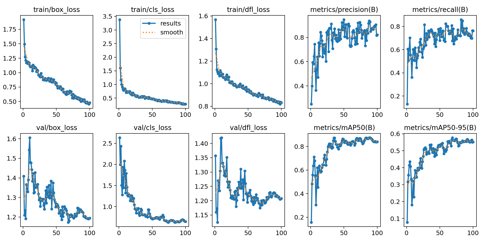

## 使用 Mask Wearing 資料集進行訓練
https://public.roboflow.com/object-detection/mask-wearing/4

## 訓練過程：
訓練：

`!yolo task=detect mode=train model=yolov8s.pt data=/content/Mask-Wearing-4/data.yaml epochs=100 imgsz=640`

/content/Mask-Wearing-4/data.yaml 為colab下載dataset時存放的路徑

訓練後測試：

`!yolo task=detect mode=val model=/content/runs/detect/train/weights/best.pt data=/content/Mask-Wearing-4/data.yaml split=test`

訓練和測試結果會被放在/runs的資料夾

## 訓練結果：

testset 測試結果：

原先testset labels：
